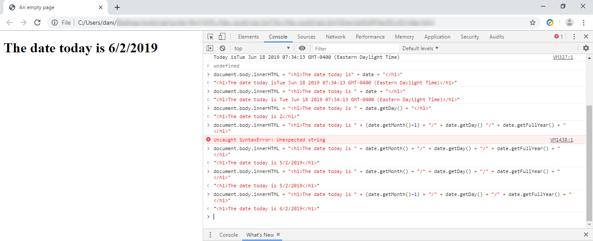

## JavaScript, the browser implementation of the specification ECMAScript
**ECMA** stands for `European Computer Manufacturers Association`<br>

<br>
`JavaScript` has nothing to do with `Java` they are two independent programming languages, JavaScript was created by Netscape<br>
To the server, JavaScript code is merely text, just like HTML. To the web browser, however, this text has special meaning <br>
that can be interpreted differently, JavaScript has become one of the pillars of the Web.<br>
You can write **client-side** programs to be executed in the web browser, JavaScript is useful because it’s deeply integrated with the browser.<br>
Modern browsers support core JavaScript, **DOM** manipulation, the XmlHttpRequest object (used to make Ajax requests), and basic CSS. <br>
In sum, modern browsers are capable of making the most of today’s dynamic Web technologies. <br>
It’s useful because it enables the developer to manipulate the contents of a web page after it has loaded, making it possible<br>
 to provide users with instant feedback when they make a change in a form.<br>
Loading resources on demand for performance reasons, or building full-blown user interfaces that resemble desktop applications.<br>
JavaScript uses what’s referred to as an `event-driven` model of execution. When you embed JavaScript code in a web page, <br>
it isn’t run until the event it’s associated with is triggered.<br>
The browser integration allows programmers to manipulate various aspects of the browser behavior, as well as objects included on the page.<br>
JavaScript uses what’s referred to as an event-driven model of execution. <br>
When you embed JavaScript code in a web page, it isn’t run until the event it’s associated with is triggered.<br>
The types of events that can call JavaScript include:<br>
* Loading the page
* Leaving the page
* Interacting with a form element
* Clicking a link
* Scrolling up or down
Plenty of other events are available, too.<br>

## Window object - Hierarchy top level
Type **window** and press enter to see the `window object` along with a long list of **methods** and **properties**.<br>
<br>

## Document object
```javascript
console.dir(document)
```
Or simple type **"document"**

## Browser interpreting JavaScript<br>
```javascript
document.body.innerHTML = "Hello World"
```
<br>
The **innerHTML** will give you basically everything, all the HTML, which is inside the element.<br>
That's how we can insert HTML, **innerHTML** property of the `document.body` element's HTML.

## Browser Console - press F12
JavaScript changes the browser from an application for displaying documents to a platform for writing applications.<br>
<br>

## From the Browser to the Backend
JavaScript has expanded to the backend with `Node.js` or `Deno`<br>
<br>
## Addition example
The image below shows one small example of what can be done with JavaScript<br>
Notice that values are entered by filling two browser's input boxes but the result is only shown in the browser console (F12)<br>
<br>

## Grab the HTML code
```html
<!DOCTYPE html>
<html lang="en">
  <head>
    <meta charset="UTF-8" />
    <meta name="viewport" content="width=device-width, initial-scale=1.0" />
    <meta http-equiv="X-UA-Compatible" content="ie=edge" />
    <title>JavaScript</title>
    <script src="untyped-mitigation.js" defer></script>
  </head>
  <body>
    <input type="number" id="num1" placeholder="Number 1" />
    <input type="number" id="num2" placeholder="Number 2" />
    <button>Addition</button>
  </body>
</html>
```
## Working with numbers in JavaScript 
Do NOT fall into the wrong **data type** when working with numbers.<br>
JavaScript is a **loosely-typed** scripting language, and it will automatically convert any value to a string when it needs to.<br>
To avoid numbers from being considered as strings we must specify the **data type** by using `typeof num === 'number'`.<br>
<br>
If we do not take meticulous care of the **data type**, we may easily get in trouble and our numbers will be **concatenated instead of added**.<br>
```javascript
const button = document.querySelector("button");
const input1 = document.getElementById("num1");
const input2 = document.getElementById("num2");

function add(num1, num2) {
  if ( typeof num1 === 'Number' && typeof num2 === 'Number' ){
    return num1 + num2;
  } else {
    return +num1 + +num2;
  }
}

button.addEventListener("click", function() {
  console.log(add(input1.value, input2.value));
});
```
## You better test, never assume anything
We can make use of **"typeof"** operator to test and see if we are getting the wrong data type.<br>
```javascript
function calculateValue(num) {
 if (typeof num !== 'number') {
 throw new TypeError(`Value [${num}] is not a number.`);
 }
}
```
